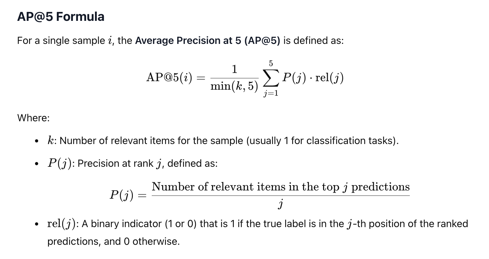

#### Machine Learning Pipeline

For the classifcal machine learning approach, we went ahead with the tested and proven XGBoost classifier model.

The metric will be the MAP@5. 

#### Data Cleaning and Transformation

There were some datetime columns that had to be transformed into floating points. I extracted year, month, day from some of these fields. 
To reduce effect of potential outliers, I made sure to implement winsorizing to cap items at their lower and upper bounds, defined as: 
lower_bound = Q1 - 1.5 * IQR
upper_bound = Q3 + 1.5 * IQR

Some null values are replaced with the mean of the entire column. There were not many of them, so a simple approach would suffice here.

#### Modeling 
This function trains an XGBoost model for multiclass classification using 5-fold cross-validation. It evaluates the model's performance using the Mean Average Precision at k (MAP@k) metric and plots a confusion matrix after all folds are completed.
For the stratified K-fold, I ended up splitting the dataset into n_splits folds while maintaining the class distribution in each fold.

For each fold:
  -The training and testing sets are created.
  -An XGBoost classifier is trained on the training set.
  -Predictions are made on the testing set.

The model itself is a XGBoost classifier, initialized with the following parameters:

1. objective="multi:softprob": Configures the model for multiclass classification, outputting probabilities for each class.
2. num_class: The number of unique classes in the target column.
3. eval_metric="mlogloss": Uses multi-class log loss as the evaluation metric.
4. max_depth=10: Sets the maximum depth of the decision trees to reduce overfitting. 
5. n_jobs=-1: Utilizes all available CPU cores for training.

For each fold, the MAP@5 metric is calculated for the specified k_values=5. 
The predictions are ranked by probability, and the true label's position in the top k predictions is evaluated.
The MAP@5 scores for each fold are stored and averaged across all folds.

After all folds are completed, the true labels and top-1 predictions from all folds are aggregated. I also plotted the confusion matrix using seaborn.heatmap.

After the model is trained, I then created a function to plot the feature importances to see which features are most important. The top 10 are considered for the streamlit application. 
